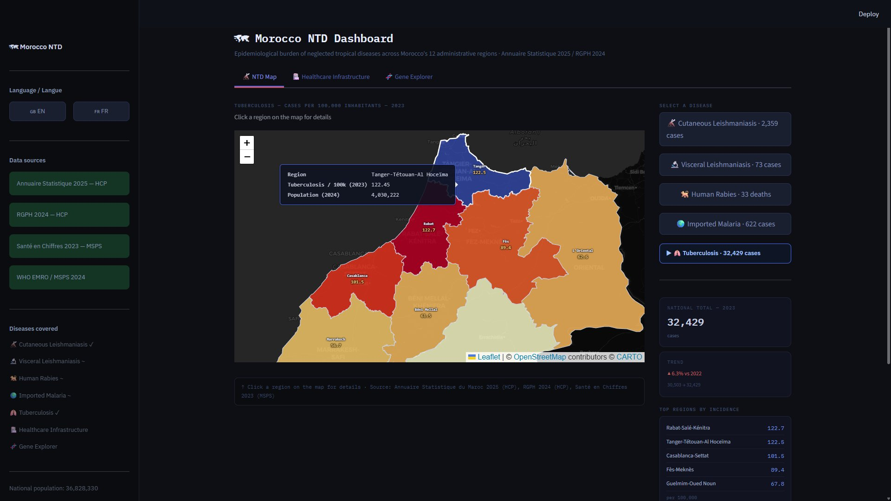
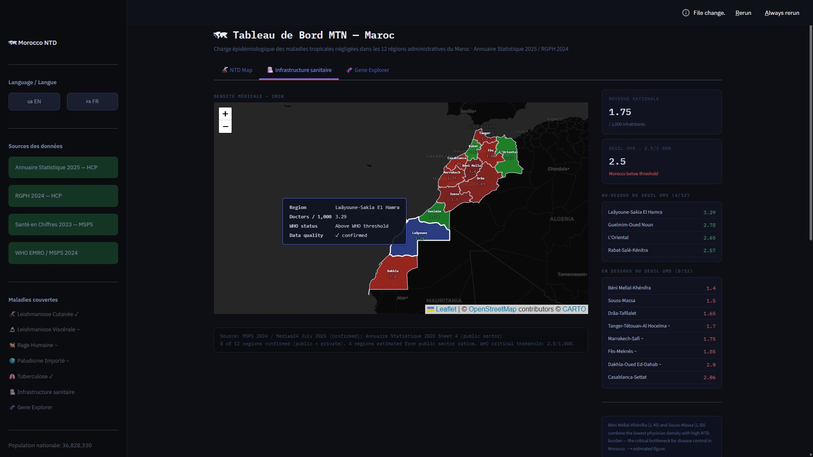
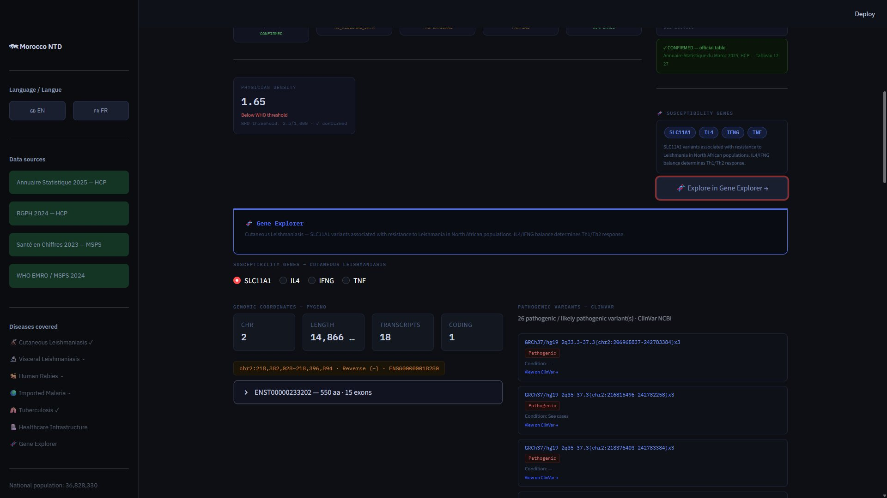

# 🗺 Morocco NTD Dashboard
**Epidemiological burden of neglected tropical diseases across Morocco's 12 administrative regions**

An interactive Streamlit dashboard mapping disease burden, healthcare infrastructure, and genomic susceptibility data for neglected tropical diseases in Morocco. Built as part of a bioinformatics portfolio alongside [pyGeno Scouter](https://github.com/Thatguybassam/pygeno-scouter).

---

## Data confidence — important

Each disease layer is explicitly labeled with one of four confidence levels:

| Level | Meaning |
|---|---|
| **CONFIRMED** | Figures extracted directly from official government tables |
| **PROPORTIONAL** | National total confirmed; regional distribution derived from historical cumulative data |
| **PARTIAL** | One or more regions confirmed; remainder proportionally distributed |
| **NO REGIONAL DATA** | National total confirmed; no regional breakdown exists in any public source |

### Per-disease transparency

**Cutaneous Leishmaniasis** `CONFIRMED`
Regional figures extracted directly from Annuaire Statistique du Maroc 2025, HCP — Tableau 12-27 ("Maladies sous surveillance par province, Année 2023"). National total verified: 2,359 cases.

**Tuberculosis** `CONFIRMED`
Same source — Tableau 12-27. National total verified: 32,429 cases (including 625 unattributed to a region).

**Human Rabies** `PROPORTIONAL`
National totals confirmed: 19 deaths (2023, Santé en Chiffres 2023), 33 deaths (2024, MSPS/WHO EMRO bulletin). Annual regional breakdown does not exist in any publicly available official source — confirmed by exhaustive search of MSPS, DELM, and WHO EMRO publications (Gemini Deep Research, March 2026). Regional distribution on the map is proportionally derived from DELM cumulative 2013–2023 data (198 total cases over the period) published in a WOAH Africa / DELM epidemiological presentation (2025). This is not an annual confirmed breakdown.

**Imported Malaria** `PARTIAL`
National total confirmed: 622 cases (2023, Santé en Chiffres 2023). Casablanca-Settat confirmed: 55 cases (2023, Rapport Régional Casablanca-Settat ODD 2025, ecoactu.ma). Full 12-region annual breakdown does not exist in any public official source — confirmed absent by Gemini Deep Research, March 2026. Remaining 567 cases distributed proportionally based on historical migration corridor data (DELM / Rapport National ODD 2024: Casablanca + Marrakech + Souss-Massa account for >50% of national burden).

**Visceral Leishmaniasis** `NO REGIONAL DATA`
National total confirmed: 73 cases (2023, Santé en Chiffres 2023). Regional breakdown is not published in Santé en Chiffres 2023 Part III, DELM bulletins, or any other accessible MSPS source — confirmed by exhaustive search (Gemini Deep Research, March 2026). No choropleth is rendered for this disease. The national total is displayed directly.

---

## Screenshots

**NTD Map — Tuberculosis with region hover:**


**Healthcare Infrastructure — physician density by region:**


**Gene Explorer — pyGeno coordinates + ClinVar pathogenic variants:**


---

## What it does

- Interactive choropleth map of Morocco's 12 administrative regions colored by disease incidence per 100,000 inhabitants (RGPH 2024 normalized)
- Disease selector panel — switch between 5 NTDs and a healthcare infrastructure layer
- Region click — opens a detail panel showing all disease burdens and physician density for that region
- Gene Explorer tab — pyGeno genomic coordinates and ClinVar pathogenic variants for susceptibility genes associated with each NTD
- French / English language toggle
- Consistent dark aesthetic matching pyGeno Scouter

---

## Diseases covered

| Disease | Year | National total | Confidence |
|---|---|---|---|
| Cutaneous Leishmaniasis | 2023 | 2,359 cases | CONFIRMED |
| Visceral Leishmaniasis | 2023 | 73 cases | NO REGIONAL DATA |
| Human Rabies | 2024 | 33 deaths | PROPORTIONAL |
| Imported Malaria | 2023 | 622 cases | PARTIAL |
| Tuberculosis | 2023 | 32,429 cases | CONFIRMED |
| Healthcare infrastructure | 2024 | — | PARTIAL (4 regions estimated) |

---

## Data sources

| Source | Contents | Year |
|---|---|---|
| Annuaire Statistique du Maroc 2025, HCP | Regional disease surveillance (Tableau 12-27), physician distribution by region (Tableau 12-4) | January 2026 |
| RGPH 2024, HCP | Legal population by region — all 12 regions | November 2024 |
| Santé en Chiffres 2023, MSPS | National MDO totals (Tab 1.5) | 2023 |
| Rapport Régional Casablanca-Settat ODD 2025 | Confirmed malaria figure for Casablanca | 2025 |
| WOAH Africa / DELM epidemiological presentation | Cumulative rabies cases 2013–2023 by region | 2025 |
| MSPS / WHO EMRO 2024 bulletin | Rabies deaths 2024 national total | 2024 |
| Medias24 / MSPS 2024 | Physician density confirmed figures (8 of 12 regions) | 2024 |

---

## Requirements

```
streamlit
pandas
folium
streamlit-folium
```

Also required in the root folder (copy from [pyGeno Scouter](https://github.com/Thatguybassam/pygeno-scouter)):
- `pygeno_query.py` — pyGeno subprocess backend
- `clinvar.py` — NCBI ClinVar API module

---

## Installation

```bash
git clone https://github.com/Thatguybassam/morocco-ntd-dashboard
cd morocco-ntd-dashboard
pip install streamlit pandas folium streamlit-folium

# Copy from pyGeno Scouter
copy path\to\pyGeno_Scouter\pygeno_query.py .
copy path\to\pyGeno_Scouter\clinvar.py .
```

Download Morocco-Regions.geojson from [Salah-Zkara/Morocco-GeoJson](https://github.com/Salah-Zkara/Morocco-GeoJson) and place in `data/`.

Configure `PYGENO_PYTHON` in `app.py` to point to your Python 3.6 conda environment.

```bash
streamlit run app.py
```

Opens at http://localhost:8501.

---

## Project structure

```
morocco-ntd-dashboard/
├── app.py                      # Streamlit interface
├── clinvar.py                  # ClinVar API (copy from pyGeno Scouter)
├── pygeno_query.py             # pyGeno backend (copy from pyGeno Scouter)
├── requirements.txt
├── README.md
└── data/
    ├── ntd_data.py             # Dataset with full source annotations
    └── Morocco-Regions.geojson # Local only — not committed
```

---

## Mobile

This dashboard is optimized for desktop. For mobile users, an HTML standalone version is available on the `html-demo` branch — no Python required, opens in any browser.

---

## Connection to pyGeno Scouter

Each disease panel displays the human susceptibility genes relevant to that NTD (e.g. HBB and G6PD for malaria, SLC11A1 for leishmaniasis). The Gene Explorer tab runs live pyGeno queries and ClinVar lookups for those genes directly inside the dashboard. The two tools are designed to be run together — the dashboard identifies disease burden by region, Scouter provides the genomic context.

---

## Limitations

- Regional data for visceral leishmaniasis, rabies, and malaria is not available at the 12-region level in any public official source as of March 2026. The MSPS is expected to publish fully decentralized regional bulletins by 2028 under the World Bank Health System Reform Program (P179014).
- Physician density is confirmed for 8 of 12 regions. The remaining 4 are estimated from public sector ratios.
- pyGeno requires a local Python 3.6 conda environment with GRCh38.78 imported (~4GB).
- Not validated for clinical or public health decision-making.

---

## License

MIT

Data sources: HCP (public), MSPS (public), WHO EMRO (public), WOAH Africa (public).
